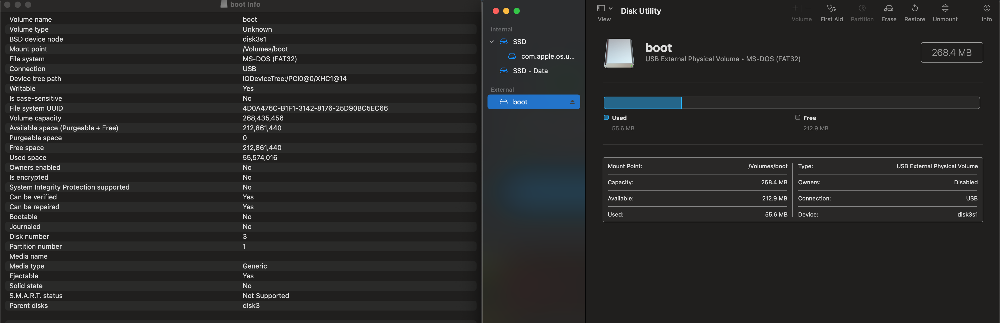

# RT-ML

## Installing LITMUS-RT on Raspberry Pi
At the time of writing this, there is technically only one complete tutorial on how to cross compile the linux/litmus kernel from a linux host machine (i.e., Ubuntu 20.04) to the Raspberry Pi OS (Raspbian OS): https://www.litmus-rt.org/doc/litmus-rt-on-raspbian.pdf.
However, there are a number of supplementary resources that were very useful:

   * 
   * 
   *


### Installing Raspbian on Raspberry Pi
One can use the balenaEtcher tool to flash the Raspbian OS to the microSD card. One could also use the Pi Filler or the Raspberry Pi Imager utilities. I downloaded the most recent full version (2021-05-07-raspios-buster-armhf-full.img). This took about 20 minutes. After the image was finished flashing, I checked to see if there was a FAT32 and root EXT4 partition created:
```
(base) ➜  boot diskutil list
/dev/disk0 (internal, physical):
   #:                       TYPE NAME                    SIZE       IDENTIFIER
   0:      GUID_partition_scheme                        *1.0 TB     disk0
   1:                        EFI ⁨EFI⁩                     209.7 MB   disk0s1
   2:                 Apple_APFS ⁨Container disk1⁩         1.0 TB     disk0s2

/dev/disk1 (synthesized):
   #:                       TYPE NAME                    SIZE       IDENTIFIER
   0:      APFS Container Scheme -                      +1.0 TB     disk1
                                 Physical Store disk0s2
   1:                APFS Volume ⁨SSD - Data⁩              691.1 GB   disk1s1
   2:                APFS Volume ⁨Preboot⁩                 369.8 MB   disk1s2
   3:                APFS Volume ⁨Recovery⁩                610.8 MB   disk1s3
   4:                APFS Volume ⁨VM⁩                      6.4 GB     disk1s4
   5:                APFS Volume ⁨SSD⁩                     19.4 GB    disk1s5
   6:              APFS Snapshot ⁨com.apple.os.update-...⁩ 19.4 GB    disk1s5s1

/dev/disk3 (external, physical):
   #:                       TYPE NAME                    SIZE       IDENTIFIER
   0:     FDisk_partition_scheme                        *32.0 GB    disk3
   1:             Windows_FAT_32 ⁨boot⁩                    268.4 MB   disk3s1
   2:                      Linux ⁨⁩                        8.3 GB     disk3s2
                    (free space)                         23.4 GB    -
```

After flashing Raspbian to the SD card, the SD card needs to be inserted into the Pi's microSD card slot. Then, plugging in the necessary peripherals (e.g., keyboard, mouse, power supply) and waiting for the OS to boot up. Of course, one should give their Pi internet access: https://cdn-learn.adafruit.com/downloads/pdf/adafruits-raspberry-pi-lesson-3-network-setup.pdf and enable SSH to transfer files between the host computer and Pi.

### Cross-Compiling Linux
Technically, one could install LITMUS-RT directly from the Pi. However, people often prefer to cross-compile linux/LITMUS-RT on a more performant host computer. The main reason for cross-compiling from another computer is because...
I first needed to clone the linux repo and add the litmut-RT repo within it.

### Running Raspbian on 


Needed to install
```
sudo apt-get install libssl-dev
```