# INSTALLING LITMUS^RT on Raspberry Pi
This guide has been developed to guide systems researchers on extending the RaspbianOS with LITMUS^RT to be compatible with the Rapsberry Pi Model B+

## Installing RaspbianOS on microSD card
One can use the balenaEtcher tool to flash the Raspbian OS to the microSD card. One could also use the Pi Filler or the Raspberry Pi Imager utilities. I downloaded the most recent full version (2021-05-07-raspios-buster-armhf-full.img). This took about 20 minutes. 

## Obtaining default configuration file
After flashing the microSD card with RaspbianOS and insert the microSD card back into the Raspberry Pi. Then, plugging in the necessary peripherals (e.g., keyboard, mouse, power supply) and waiting for the OS to boot up. Go through the Raspbian set up, making sure to give the Raspberry Pi [internet access](https://cdn-learn.adafruit.com/downloads/pdf/adafruits-raspberry-pi-lesson-3-network-setup.pdf) and [enable SSH](https://www.raspberrypi.org/documentation/computers/remote-access.html) to transfer files between the host computer and Pi.

From the host computer SSH into the Raspberry Pi and obtain the kernel configuration file:
```
user@ubuntuhost:~$ ssh pi@XXX.XXX.X.XX
pi@XXX.XXX.X.XX's password:
pi@raspberrypi:~ $ sudo modprobe configs
```

The configuration file of interest (config.gz) will be located in the proc directory. Copy this from that location and place it in the Desktop directory (this file will be used later in the kernel building process):

```
pi@raspberrypi:~ $ cd /proc
pi@raspberrypi:/proc $ cp config.gz ~/Desktop/config.gz
```

## Patching LITMUS^RT to the linux kernel
From the host computer in another terminal window (so that the host computer still has the terminal window SSH'd into the Raspberry Pi), clone the Raspberry Pi Linux kernel repository to the home Desktop:

```
user@ubuntuhost:~$ cd ~/Desktop
user@ubuntuhost:~/Desktop$ git clone https://github.com/raspberrypi/linux.git
```

Move into the recently created linux directory and checkout the 4.9.y stable release:

```
user@ubuntuhost:~/Desktop/linux$ git remote add litmus https://github.com/LITMUS-RT/litmus-rt.git
user@ubuntuhost:~/Desktop/linux$ git fetch litmus
user@ubuntuhost:~/Desktop/linux$ git remote -v
```

Then, still from within the linux directory add the LITMUS^RT repository:

```
user@ubuntuhost:~/Desktop$ cd linux
user@ubuntuhost:~/Desktop/linux$ git checkout rpi-4.9.y-stable
```

[Cherry pick](https://git-scm.com/docs/git-cherry-pick) the litmus commits from the litmus branch and apply them:
```
user@ubuntuhost:~/Desktop/linux$ git cherry-pick rpi-4.9.y-stable..litmus/linux-4.9-litmus
user@ubuntuhost:~/Desktop/linux$
```

There will be an error of the form "Apr 6 19:38… error: commit ae76… is a merge but no -m option was given" which is resolved by the following:
```
user@ubuntuhost:~/Desktop/linux$ git cherry-pick -m 1 ae762a4dbb7020692f53358e0cb6aa9a923edf48
user@ubuntuhost:~/Desktop/linux$ git commit –-allow-empty
user@ubuntuhost:~/Desktop/linux$ git cherry-pick --continue
```

## Cross compiling on host computer
First, make sure all of the necessary packages for the RaspbianOS kernel cross-compilation are installed:
```
user@ubuntuhost:~/Desktop/linux$ sudo apt-get install libncurses5-dev libncursesw5-dev
```

Clone the linux toolchain on the host computer's home directory:
```
user@ubuntuhost:~/Desktop/linux$ cd ~/
user@ubuntuhost:~$ git clone https://github.com/raspberrypi/tools ~/tools
```

Add the PATH environment to make the system aware of the file location:
```
user@ubuntuhost:~$ echo PATH=\$PATH:~/tools/arm-bcm2708/gcc-linaro-arm-linuxgnueabihf-raspbian-x64/bin >> ~/.bashrc source ~/.bashrc
```

Move back into the linux directory and copy the configuration file from the raspberry pi to the ubuntu host from before. Once the file has been copied, extract it:

```
user@ubuntuhost:~$ cd /Desktop/linux
user@ubuntuhost:~/Desktop/linux$ scp pi@XXX.XXX.X.XX:~/Desktop/config.gz .
pi@XXX.XXX.X.XX's password:
user@ubuntuhost:~/Desktop/linux$ zcat config.gz
```

Switch back to the terminal that is SSH'd into the Raspberry Pi so that it can be powered off.
```
pi@raspberrypi:/proc $ sudo poweroff
```

Run the make command with the following options to start the cross compilation configuration of .config using [menuconfig](https://en.wikipedia.org/wiki/Menuconfig):

```
user@ubuntuhost:~/Desktop/linux$ make ARCH=arm CROSS_COMPILE=arm-linux-gnueabihf- menuconfig
```
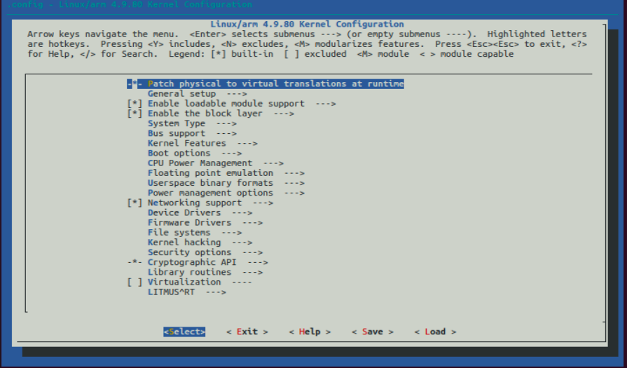

Once menuconfig is running use the arrow keys to navigate to and set the following options:

1. **Set the local version name:**
   Under _General setup > Local version - append to kernel release_ enter any useful identifying string value for example, "-v7-test"
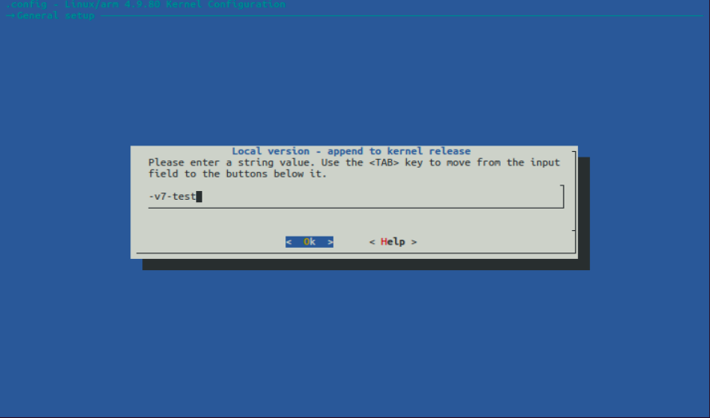

2. **Enable in-kernel preemptions:**
   Under _Kernel Features > Preemption Model_ select "Preemptible Kernel (Low-Latency Desktop)"
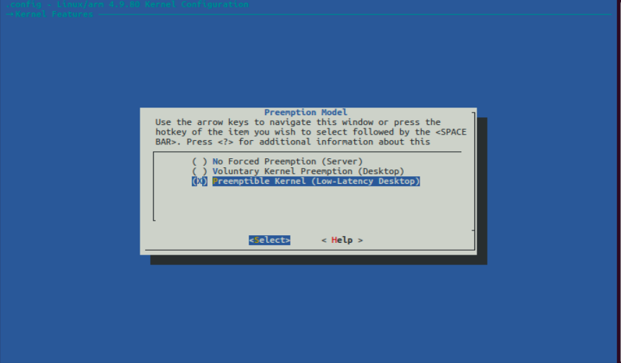

3. **Disable group scheduling:**
   First, under _General setup_ disable "Automatic process group scheduling"
   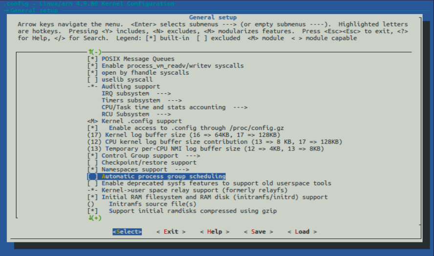
   Second, under _General setup > Control group support > CPU controller_ disable "Group scheduling for SCHED_OTHER"
   

4. **Set periodic timer ticks:**
   Under _General setup > Timers subsystem > Timer tick handling_ select "Periodic timer ticks (constant rate, no dynticks)"
   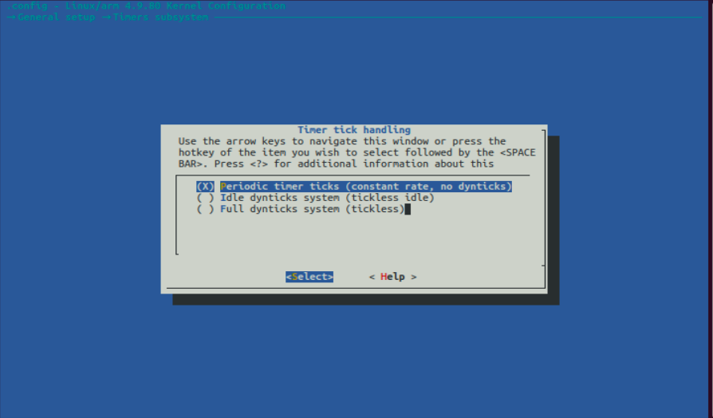
   
5. **Disable power management options:**
   Under _Power management options_ make sure "Suspend to RAM and standby" and "Hibernation (aka 'suspend to disk') are disabled.
   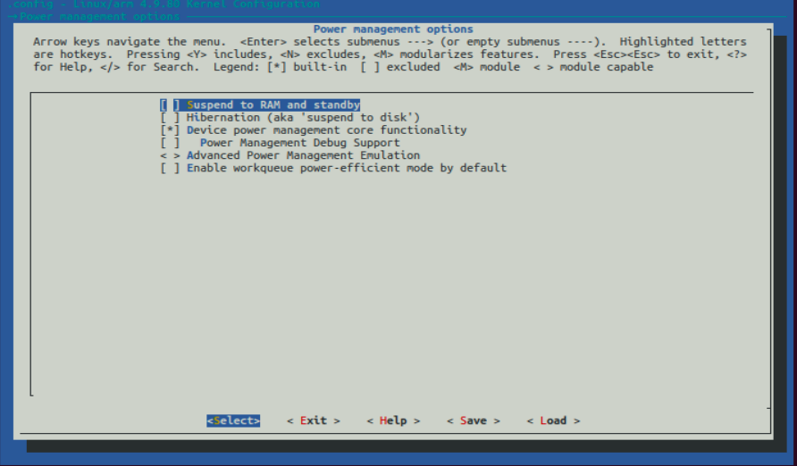

6. **Disable frequency scaling:**
   Under _CPU Power Management > CPU Frequency scaling_ disable "CPU Frequency scaling"
   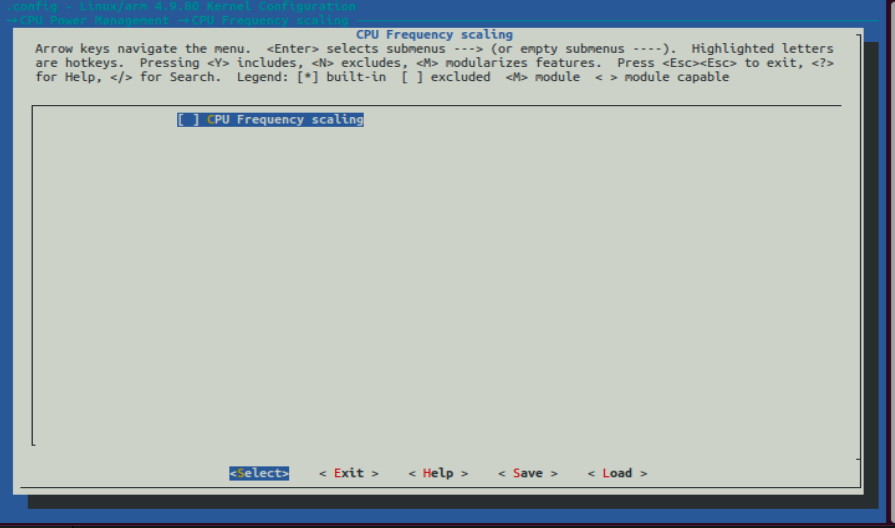

7. **Enable I2C device drivers**
   First, under _Device Drivers > I2C support_ make sure "I2C support" is enabled.
   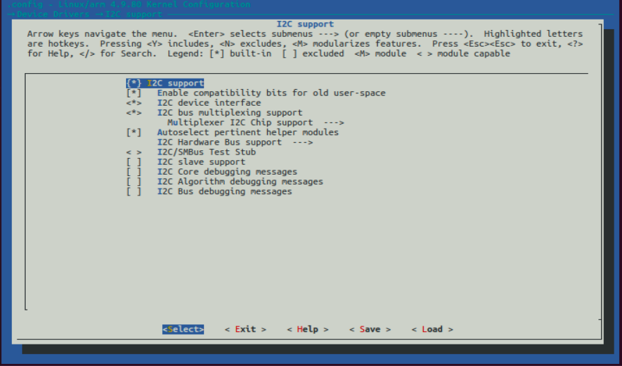
   Second, under _Device Drivers > I2C support > I2C Hardware Bus support_ enable "BCM2708 BSC", "Broadcom BCM2835 I2C controller, and "GPIO-based bitbanging I2C"
   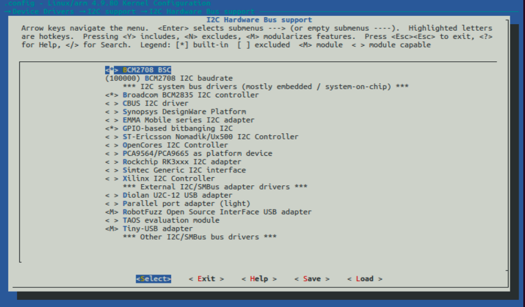

8. **Decide on development or benchmarking**
   If doing development on LITMUS^RT, then under _LITMUS^RT > Tracing_ enable "TRACE() debugging". Otherwise, leave it disabled.
   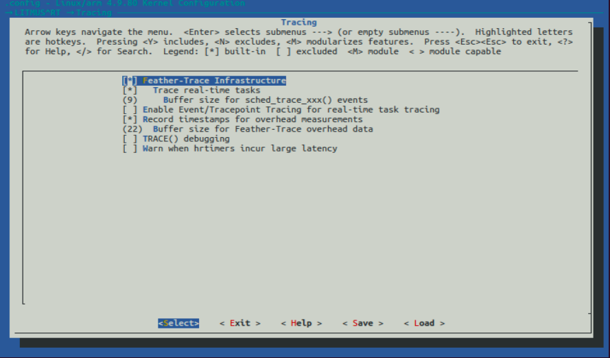

After all the above options have been specified, save and exit.  

## Building the kernel
Begin cross-compiling the kernel using the -j parameter to try and speedup the kernel build time.

Build the sources and Device Tree files:
```
user@ubuntuhost:~/Desktop/linux$ sudo make ARCH=arm CROSS_COMPILE=arm-linux-gnueabihf- bcm2709_defconfig -j 2
```

Build with Configs:
```
user@ubuntuhost:~/Desktop/linux$ sudo make ARCH=arm CROSS_COMPILE=arm-linux-gnueabihf- zImage modules dtbs -j 2
```

## Copying kernel onto Raspberry Pi microSD card
After building the kernel install the modules and copy it onto the microSD card (SD card) that will be used with the Raspberry Pi.

Use the `lsblk` command to identify the mount points of the SD card containing the RaspbianOS boot (FAT32) and root (EXFAT) partitions after inserting the SD card into the host computer:
```
user@ubuntuhost:~/Desktop/linux$ lsblk
NAME        MAJ:MIN RM  SIZE RO TYPE MOUNTPOINT
sdb     8:16    1 29.7G  0 disk 
├─sdb1  8:17    1  256M  0 part /media/user/boot
└─sdb2 8:18     1 29.5G  0 part /media/user/rootfs1
```

Install the kernel modules directly onto the SD card:
```
user@ubuntuhost:~/Desktop/linux$ sudo env PATH=$PATH make ARCH=arm CROSS_COMPILE=arm-linux-gnueabihf- INSTALL_MOD_PATH=/media/user/rootfs1 modules_install
```

Copy the kernel and Device Tree blobs onto the SD card specifying a new kernel.img name (e.g., "kernel_litmus.img") as to avoid overwriting the existing kernel:
```
user@ubuntuhost:~/Desktop/linux$ sudo cp arch/arm/boot/zImage /media/user/boot/kernel_litmus.img
user@ubuntuhost:~/Desktop/linux$ sudo cp arch/arm/boot/dts/*.dtb /media/user/boot/
user@ubuntuhost:~/Desktop/linux$ sudo cp arch/arm/boot/dts/overlays/*.dtb* /media/user/boot/overlays/
user@ubuntuhost:~/Desktop/linux$ sudo cp arch/arm/boot/dts/overlays/README /media/user/boot/overlays/
```

## Loading patched linux kernel onto Raspberry Pi
After successfully copying the patched linux kernel onto the microSD card demount it and insert it back into the Raspberry Pi and boot:
```
user@ubuntuhost:~/Desktop/linux$ umount /media/user/boot 
user@ubuntuhost:~/Desktop/linux$ umount /media/user/rootfs1
```

Once the Raspberry Pi has completely booted up, ssh into it from the host computer and check if the `uname -r` command gives the correct local version name (e.g., "v7-test"):
```
pi@raspberrypi:~ $ uname -r 
4.9.80-v7-test+
```

Next, check to see if the LITMUS^RT schedulers are accessible:
```
pi@raspberrypi:~ $  cat /proc/litmus/plugins/loaded
P-RES
PFAIR
P-FP
PSN-EDF
GSN-EDF
Linux
```

## Installing liblitmus and feather-trace-tools
First, make sure the libncurses-dev, git, and libssl-dev packages are installed.
```
pi@raspberrypi:~ $ sudo apt-get install libncurses-dev git libssl-dev
```

Under the opt directory in root space create a folder called "litmus-related" to store the litmus-rt, liblitmus, and feather-trace-tools directories. Additionally, create a folder called "mytools" that will store user created RT task. 
```
pi@raspberrypi:~ $ cd /opt
pi@raspberrypi:/opt $ mkdir litmus-related
pi@raspberrypi:/opt $ cd litmus-related
pi@raspberrypi:/opt/litmus-related $ git clone https://github.com/LITMUS-RT/litmus-rt.git
pi@raspberrypi:/opt/litmus-related $ git clone https://github.com/LITMUS-RT/liblitmus.git
pi@raspberrypi:/opt/litmus-related $ git clone https://github.com/LITMUS-RT/feather-trace-tools.git
pi@raspberrypi:/opt/litmus-related $ mkdir mytools
```

Move into the recently cloned liblitmus directory and run make:
```
pi@raspberrypi:/opt/litmus-related $ cd liblitmus
pi@raspberrypi:/opt/litmus-related/liblitmus $ make 
```

Move into the recently cloned feather-trace-tools directory and run make:
```
pi@raspberrypi:/opt/litmus-related/liblitmus $ cd ../feather-trace-tools
pi@raspberrypi:/opt/litmus-related/feather-trace-tools $ make 
```

Add the PATH to the liblitmus, feather-trace-tools, and mytools directories at the end of the .bashrc files in root and home directories:
```
pi@raspberrypi:/opt/litmus-related/feather-trace-tools $ sudo su
root@raspberrypi:/opt/litmus-related/feather-trace-tools# cd /root
pi@raspberrypi:/root $ nano .bashrc
```
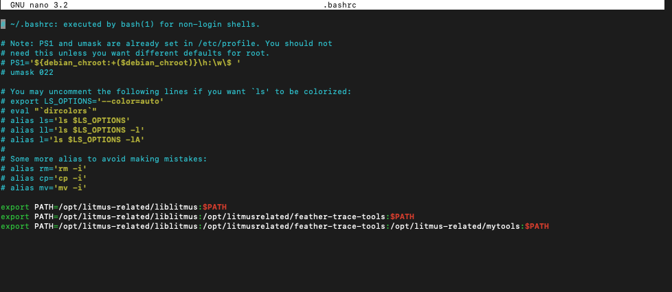


```
pi@raspberrypi:/root $ cd ~/
root@raspberrypi:/home/pi# $ nano .bashrc
```
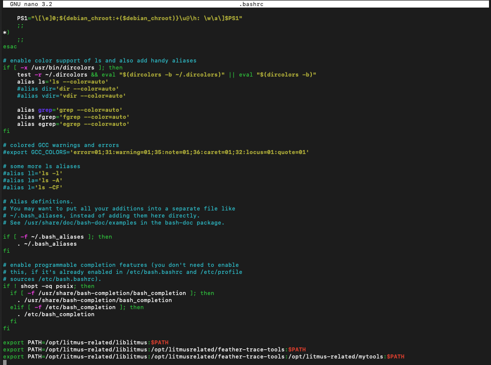

Finally, try and test changing the scheduler from Linux to P-FP
```
root@raspberrypi:/home/pi# $ showsched
Linux
root@raspberrypi:/home/pi# $ setsched P-FP
root@raspberrypi:/home/pi# $ showsched
P-FP
```

If all of the above steps have been followed through to completion, then LITMUS^RT is now successfully running on the Rapsberry Pi!