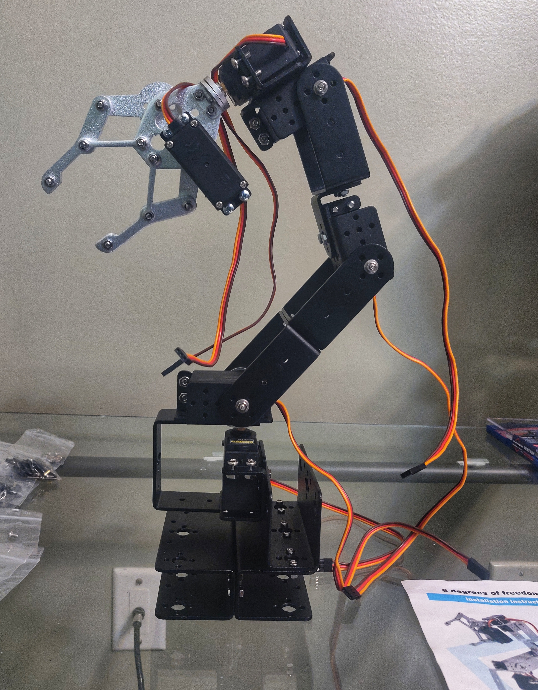
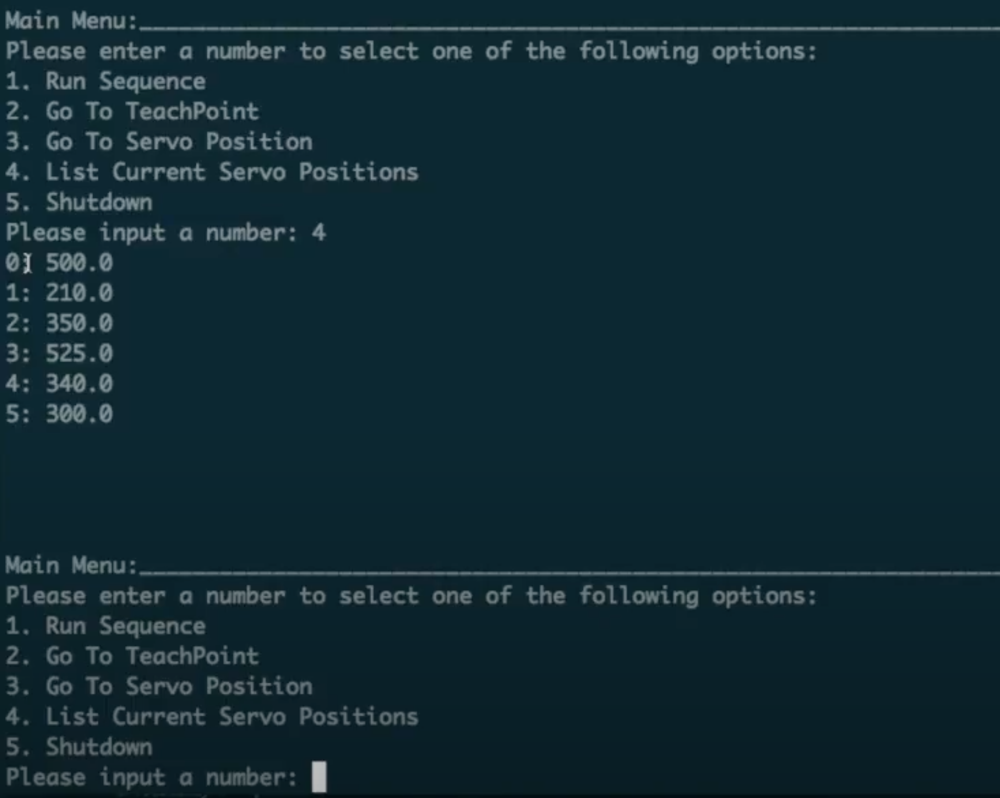

# Robotics 
This research project aims to understand how real-time constraints and resource-constrained edge devices impact machine learning (ml) pipelines. In other words, what are the necessary software and hardware modifications to perform the ml-related task on edge devices? Then, the role of robotics in this project is to accentuate this point further. Robots represent the strict deadlines cyber-physical systems are expected to meet in the real world. For example, autonomous vehicles and increasingly intelligent manufacturing equipment must perform inference (e.g., object detection) in real-time to make life and process critical decisions (e.g., object avoidance). Hence, we use edge devices (e.g., Raspberry Pi, NVIDIA Jetson) to model an intelligent control system for a robot's physical apparatus.

## Robot
The robot used for our project is the [Diymore Black ROT3U 6DOF Aluminium Robot Arm Kit](https://www.amazon.com/diymore-Aluminium-Mechanical-Robotic-Arduino/dp/B01LVVEP8K/ref=sr_1_1?keywords=diymore+Black+ROT3U+6DOF&qid=1639218734&s=toys-and-games&sr=1-1) that come with MG996 Servo motors and associated horns. A 6-axis robot arm was chosen because it depicts industrial manufacturing applications (e.g., pick and place) and is reminiscent of the larger 6DOF industrial robot arms like the KUKA KR 6 or ABB's IRB series. The selling points of this particular kit is that it's inexpensive, relatively easy to assemble, and an increasingly common 6-axis robot people test and develop with. On the other hand, some drawbacks include poor weight distribution, a flimsy end effector, and had servos with no positional feedback. Of course, if you can afford to pay more, there are some other 6-axis robot arms one can purchase like the [LewanSoul Robotic xArm](https://www.amazon.com/LewanSoul-Programmable-Feedback-Parameter-Programming/dp/B0793PFGCY/ref=asc_df_B0793PFGCY/?tag=hyprod-20&linkCode=df0&hvadid=241979941907&hvpos=&hvnetw=g&hvrand=16950045135921859151&hvpone=&hvptwo=&hvqmt=&hvdev=c&hvdvcmdl=&hvlocint=&hvlocphy=9024260&hvtargid=pla-456126058713&psc=1) or the [Yahboom Robot Arm Kit](https://www.amazon.com/dp/B08T6N36YR/ref=sspa_dk_detail_3?psc=1&pd_rd_i=B08T6N36YR&pd_rd_w=eRxua&pf_rd_p=9fd3ea7c-b77c-42ac-b43b-c872d3f37c38&pd_rd_wg=4VsXx&pf_rd_r=0DCC87ZFRMFMHE97SPCT&pd_rd_r=f83f77ed-cde2-46a2-862d-bef8ea849ba3&spLa=ZW5jcnlwdGVkUXVhbGlmaWVyPUFEVEY3TVZZV0FIRDAmZW5jcnlwdGVkSWQ9QTA2NzAyMDgxT1UxTzE3QlY3STA0JmVuY3J5cHRlZEFkSWQ9QTA4MzY2NTNRWEJJNVdDN0dGR0Qmd2lkZ2V0TmFtZT1zcF9kZXRhaWwmYWN0aW9uPWNsaWNrUmVkaXJlY3QmZG9Ob3RMb2dDbGljaz10cnVl).

## Robot Assembly
The instructions that come with the kit are by no means perfect. When assembling the Robot, I relied heavily on Automatic Addison's [How to Build a DIY Aluminium 6-DOF Robotic Arm From Scratch tutorial](https://automaticaddison.com/how-to-build-a-diy-aluminium-6-dof-robotic-arm-from-scratch/). I would read the instructions for the high-level summary and cross-reference it with Addison's tutorial. The tutorial is extensive, and halfway through assembly, it becomes very straightforward—additionally, a [YouTube video demonstrates the Robot's assembly](https://www.youtube.com/watch?v=GRNKYtz0jxQ&t=513s&ab_channel=EWALLPK).

The kit we were using was missing some of the M3 x 8mm screws, but all the screws and bolts can be purchased at a local hardware store. Additionally, Diymore sells the same [6DOF kit without the servo motors](https://www.amazon.com/dp/B07Z1QBPQZ/ref=sspa_dk_detail_1?psc=1&pd_rd_i=B07Z1QBPQZ&pd_rd_w=eRxua&pf_rd_p=9fd3ea7c-b77c-42ac-b43b-c872d3f37c38&pd_rd_wg=4VsXx&pf_rd_r=0DCC87ZFRMFMHE97SPCT&pd_rd_r=f83f77ed-cde2-46a2-862d-bef8ea849ba3&spLa=ZW5jcnlwdGVkUXVhbGlmaWVyPUFEVEY3TVZZV0FIRDAmZW5jcnlwdGVkSWQ9QTA2NzAyMDgxT1UxTzE3QlY3STA0JmVuY3J5cHRlZEFkSWQ9QTA0MzI0MDNHWVdIMUY4MEExTzcmd2lkZ2V0TmFtZT1zcF9kZXRhaWwmYWN0aW9uPWNsaWNrUmVkaXJlY3QmZG9Ob3RMb2dDbGljaz10cnVl), so if one needed any additional or spare parts, that would be a good purchase.



## Robot Movement
The robot uses six servo motors for each of its corresponding axes. To move the servos, they needed to be powered and driven by a [pulse width modulation](https://learn.sparkfun.com/tutorials/pulse-width-modulation) (PWM) signal from the edge device. Because we were using a Raspberry Pi, this was accomplished by initially using the [SparkFun Servo pHAT for Raspberry Pi](https://www.sparkfun.com/products/15316). The [Servo pHAT Hookup Guide](https://learn.sparkfun.com/tutorials/pi-servo-phat-v2-hookup-guide) goes through the necessary steps for connecting, powering, and programming the board via the Raspberry Pi. The servo pHAT is basically plugging and playing. Still, some slight [power modifications](https://learn.sparkfun.com/tutorials/how-to-work-with-jumper-pads-and-pcb-traces) (this involves cutting the power isolation PCB jumper) to the board are necessary to isolate its power from the Raspberry Pi's power, thus allowing the ability to control more servos with that pHAT. From there, one can go through the necessary steps outlined on the [PiServoHat_Py GitHub repository](httpsPiServoHat_Py://github.com/sparkfun/PiServoHat_Py). `PiServoHat_Py` is the python module for interfacing with the servo pHAT.


Once everything has been installed and the servo motors have been correctly attached to the hat, using the library is straightforward. There are [four examples](https://github.com/sparkfun/PiServoHat_Py/tree/main/examples) that come with the package, so those can immediately be tested. With that being said, the most straightforward test that can be run is to move/sweep a single servo motor's position:

```python
import pi_servo_hat
import time

# Initialize Constructor
test = pi_servo_hat.PiServoHat()

# Restart Servo Hat (in cse hat is frozen/locked)
test.restart()

# Test Run
#########################################
# Moves servo position to 0 degrees (1ms), Channel 0
mySensor.move_servo_position(0, 0)

# Pause 1 sec
time.sleep(1)

# Moves servo position to 90 degrees (2ms), Channel 0
mySensor.move_servo_position(0, 90)
```

This package can be used to construct more sophisticated servo control and ultimately choreograph robot movement sequences.

### `robotcontrol`
In addition to the `PiServoHat_Py` modules, investigations into the `robotcontrol` project were done. The `robotcontrol` project is a menu-based control software for the movement of 6DOF robots driven by a servo HAT/shield that uses a PCA9685 - a 16 channel PWM integrated circuit (e.g., SparkFun Servo pHAT). The software allows one to set individual servo positions, create "teach points," and more extensive sequences based on said teach points. The main benefit of this software is that it allows one to quickly probe the servos and demonstrate a variety of pre-planned movements. Instructions for installing and using the software can be found [here](https://github.com/mechiris/RobotControl), and a video demonstration of the project is [here](https://www.youtube.com/watch?v=K-S0mYAwbZI&ab_channel=RyanL.Smith).



There were some difficulties with setting teach points and sequences of moves as is suggested in the documentation, but the source code for the project is easy enough to work with that changes can be made to overcome such difficulties.

### Alternative Servo Hat
The Adafruit 16-Channel PWM / Servo HAT for Raspberry Pi was also used. The main difference between this hat and the SparkFun HAT is that, in practice, the Adafruit HAT was more reliable at driving the six servos. Also, this hat required soldering and assembly. The overview of and how to operate the HAT is detailed [here](https://learn.adafruit.com/adafruit-16-channel-pwm-servo-hat-for-raspberry-pi/).


